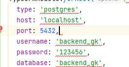
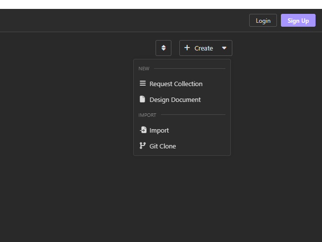

### BACKEND

Cette **API** developpée avec le Langage **Nodejs** et le framework NestJS.

### Fonctionnalités

- [x] **CRUD** des catégories
- [x] **CRUD** des utilisateurs
- [x] **CRUD** des articles
- [x] **CRUD** des commentaires
- [x] Authentification avec **JWT**

### Installation en local

#### Cloner le projet git

Avant tout , télécharger le projet dans un répertoire

#### Configuration

Vous pouvez modifier les paramètres de connexion à la base de donnée dans le fichier :

src/app.module.ts



#### Démarrer posgresql et lancer composer install

```sh
  npm install
```

#### Création de la base de donnée

```sh
psql postgres 
CREATE DATABASE backend_gk;
CREATE USER backend_gk WITH ENCRYPTED PASSWORD '123456';
GRANT ALL PRIVILEGES ON DATABASE backend_gk to backend_gk;
EXIT
```

### Importer les données

```sh
psql postgres
\c backend_gk
\i base.sql
exit 
```

### Aperçu de l'API

Vous pouvez importer le fichier **Insomnia_backend.json** dans postman pour tester l'API



### Contributeurs

- Guelade Kévin
